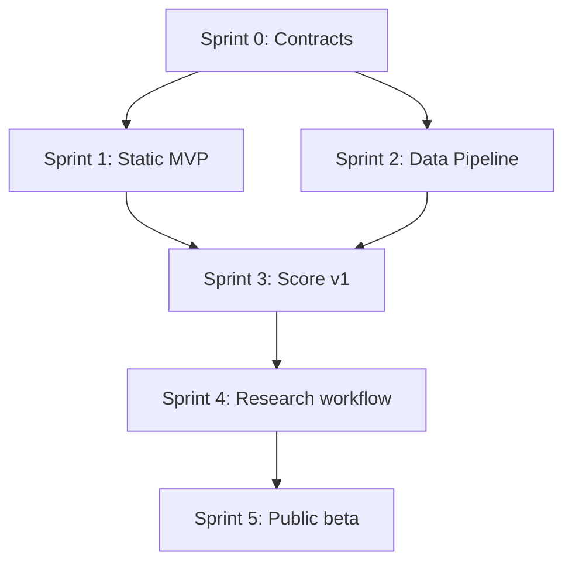

# Master Roadmap

Planning assumption: one-week sprints, one primary developer using Grok in Cursor, with Linear as the issue tracker. Change cadence if available time is lower; keep the order and milestone gates.

## 1. Roadmap summary

| Sprint | Outcome | Release state |
| --- | --- | --- |
| 0 — Foundation | Repository, contracts, methodology baseline, seed plan | Internal |
| 1 — Static MVP | Complete 30-team static experience using curated data | Local alpha |
| 2 — Data Pipeline | Automated core stats and reliable scheduled builds | Hosted alpha |
| 3 — Score v1 | Draft incentive, scoring engine, confidence, backtest | Private beta |
| 4 — Research & Social | Evidence queue, news/Reddit discovery, draft index | Editorial beta |
| 5 — History & Launch | Snapshots, sharing, QA, deployment, launch operations | Public beta |

Target: a public beta after six focused sprints. A smaller proof of concept is usable after Sprint 1.

## 2. Milestones and gates

### Milestone A — Product contract locked

Completed by Sprint 0.

Gate:

- Product terminology agreed.
- Team and evidence schemas validate.
- Score v0 is documented as provisional.
- Social evidence rules are explicit.
- Source and licensing risks are recorded.

### Milestone B — Manual static MVP

Completed by Sprint 1.

Gate:

- All 30 teams render.
- Responsive filters and team pages work.
- Curated data can be updated without code changes.
- “Bad versus tanking” distinction is immediately understandable.
- Methodology page is public.

### Milestone C — Reliable automation

Completed by Sprint 2.

Gate:

- Scheduled job generates schema-valid core data.
- Last-known-good behavior is tested.
- Production exposes no secrets.
- Stale data is visible.
- YunoBall integration decision is implemented or formally deferred.

### Milestone D — Defensible score

Completed by Sprint 3.

Gate:

- Score and confidence are reproducible.
- Pick control and applicable lottery rules are represented.
- Backtest report documents known cases and false positives.
- Injury-related controls pass.
- Weight changes are documented.

### Milestone E — Sustainable evidence workflow

Completed by Sprint 4.

Gate:

- Research leads are separated from accepted evidence.
- Reddit can create leads but cannot change scores.
- Draft Class Strength Index is versioned and sourced.
- Weekly review packet is generated.
- Evidence status transitions are tested.

### Milestone F — Public beta

Completed by Sprint 5.

Gate:

- History and score change are visible.
- Social preview routes work.
- Accessibility, performance, SEO, and mobile QA pass.
- Corrections and methodology-change workflows exist.
- Launch dataset is reviewed for all 30 teams.

## 3. Dependency map

## 4. Release strategy

### Local alpha

Use curated data. Optimize the explanation and interaction before automating judgment.

### Hosted alpha

Deploy automatically generated core statistics while keeping team state and evidence manual.

### Private beta

Invite a few knowledgeable NBA fans to review whether explanations are understandable and whether obvious false positives appear.

### Public beta

Launch with conservative claims, a methodology link on every team page, correction contact, and visible data timestamps.

## 5. Validation strategy

### Product validation

- Can a visitor identify “bad but trying” in under 15 seconds?
- Does each high score explain what changed?
- Do users open team evidence rather than treating the score as unexplained authority?
- Are score movements stable until meaningful events occur?

### Data/model validation

- Backtest known league actions.
- Track false positives from legitimate injury/rest cases.
- Compare calculated output to independent expert review without optimizing merely to consensus.
- Audit teams with high draft incentive but no deployment anomaly.
- Audit teams with suspicious deployment but no draft benefit.

### Operational validation

- Simulate failed sources and invalid schemas.
- Confirm last-known-good publication.
- Confirm every published snapshot is reproducible.
- Confirm manual overrides expire or surface for review.

## 6. Risks and responses

| Risk | Response |
| --- | --- |
| Accusatory or misleading language | Use “signals,” confidence, evidence, and official-action distinctions |
| Injury false positives | Require corroboration and apply availability guardrails |
| Pick-protection mistakes | Manual verification and dated sources before automation |
| NBA endpoint instability | Cache inputs and retain last-known-good output |
| Social rumor contamination | Tier D discovery-only rule |
| Score overfitting | Keep transparent weights and publish backtest limitations |
| Scope expansion | Keep ideas outside MVP until a milestone gate passes |
| Offseason staleness | Use Competitive Outlook mode and low confidence |

## 7. Post-beta roadmap

Consider only after the public beta is stable:

- Interactive score component explorer.
- Team comparison pages.
- Email/Slack-style weekly digest.
- Public API or downloadable snapshots.
- Community “vibes” voting shown separately from evidence.
- Social share-card generation.
- Trade/pick scenario simulator.
- Multi-season historical tanking archive.
- Model-assisted evidence extraction with human review.

## 8. Roadmap change rule

A new feature enters a sprint only if it:

1. Supports the current milestone gate.
2. Has explicit acceptance criteria.
3. Does not weaken evidence or injury guardrails.
4. Has an owner and dependency assessment.

Otherwise, add it to `05_IDEAS_BACKLOG.md`.

